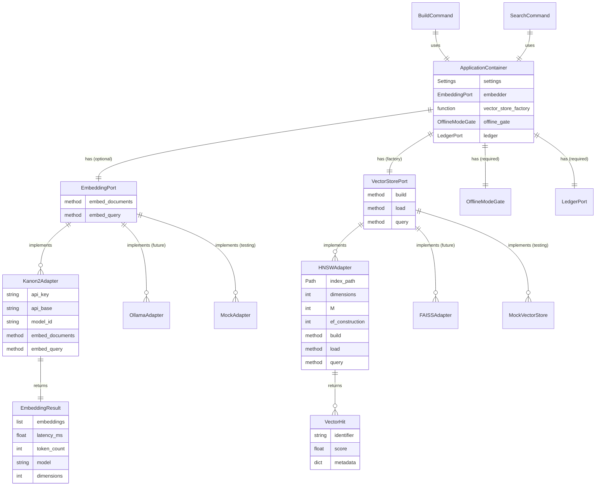

# Complete Kanon 2 Dense/Hybrid Retrieval Integration with Hexagonal Architecture Compliance

## Overview

**Status:** Partially Implemented (70% complete)
**Type:** Enhancement + Refactoring
**Priority:** High
**Estimated Effort:** 3-5 days

RexLit currently has a working implementation of dense embeddings and hybrid search using Kanon 2 (Isaacus API) and HNSW vector storage. However, the implementation exists outside the ports-and-adapters architecture, violating import contracts and limiting testability. This issue tracks the completion of Kanon 2 integration by:

1. **Refactoring** existing `kanon2_embedder.py` and `hnsw_store.py` into proper port interfaces and adapters
2. **Adding** comprehensive audit logging for embedding operations
3. **Implementing** comprehensive test coverage
4. **Updating** documentation with usage examples and self-hosted deployment guides

**Success Criteria from Next_plan.md:**
- ✅ `rexlit index build PATH --dense --dim 768 --online` produces Tantivy + HNSW artifacts that can be re-opened offline
- ✅ `rexlit search "query" --hybrid` returns results with higher Recall@10 than BM25-only
- ✅ Embedding calls refuse to run unless `--online` or `REXLIT_ONLINE=1` is present
- ⚠️ Structured audit entries with latency metrics (partially implemented)
- ⚠️ Tests and docs explain online dependency and self-host escape hatches (incomplete)

---

## Problem Statement

### Current Implementation Gaps

**1. Architecture Compliance Issues**

The existing implementation violates hexagonal architecture principles:

```python
# Current location (WRONG):
rexlit/index/kanon2_embedder.py      # Domain module directly importing API client
rexlit/index/hnsw_store.py           # Domain module managing infrastructure

# Expected location (CORRECT):
rexlit/index/ports/embedding.py        # Port interface (Protocol)
rexlit/index/ports/vector_store.py     # Vector store port (Protocol)
rexlit/index/adapters/kanon2.py        # Adapter implementation
rexlit/index/adapters/hnsw.py          # Adapter implementation
```

This causes:
- ❌ **Import contract violations**: Index domain module depends on external SDK (isaacus)
- ❌ **Difficult testing**: Cannot mock embeddings without patching internal functions
- ❌ **Tight coupling**: Changing embedding providers requires modifying domain code
- ❌ **Bootstrap bypass**: Dependencies not wired through `bootstrap.py`

### Migration Plan for Existing Modules

Current callers import `rexlit/index/kanon2_embedder.py` and `rexlit/index/hnsw_store.py`. The refactor will:
- Move the implementation into the new adapter modules while keeping backwards-compatible shims that re-export the new interfaces with a `DeprecationWarning`.
- Update internal imports and tests to consume the ports directly so downstream users have a single migration target.
- Document the import change and planned removal timeline in release notes and `README.md` to reduce upgrade friction.

**2. Incomplete Audit Trail**

Embedding operations are not logged to the audit ledger:

```python
# Missing audit log for embedding operations
# Expected in audit ledger:
{
  "operation": "embedding_batch",
  "timestamp": "2025-10-27T14:32:01Z",
  "inputs": ["sha256:abc123...", "sha256:def456..."],  # Document hashes
  "outputs": ["dense/kanon2_768.hnsw"],
  "args": {
    "model": "kanon-2-embedder",
    "dim": 768,
    "count": 1247,
    "latency_p50": 234.5,
    "latency_p95": 456.7,
    "tokens_total": 1500000,
    "task": "retrieval/document"
  },
  "previous_hash": "...",
  "entry_hash": "..."
}
```

Without audit logs:
- ❌ Cannot verify which documents were embedded
- ❌ Cannot track API usage and costs
- ❌ Cannot reproduce embeddings deterministically
- ❌ Breaks hash chain continuity

**3. Missing Test Coverage**

No tests exist for:
- ❌ Dense index building (happy path + errors)
- ❌ Hybrid search with RRF fusion
- ❌ Offline gate enforcement for embeddings
- ❌ HNSW persistence and loading
- ❌ Audit ledger entries for embedding operations
- ❌ Deterministic embedding ordering

**4. Incomplete Documentation**

Users lack guidance on:
- ❌ How to use dense/hybrid search
- ❌ How to configure Isaacus API credentials
- ❌ How to self-host embeddings (Ollama alternative)
- ❌ Memory requirements for different corpus sizes
- ❌ Matryoshka dimension tradeoffs (768 vs 1024)

---

## Current State Analysis

### What's Already Implemented ✅

**Embedding Generation** (`rexlit/index/kanon2_embedder.py:1-125`):
```python
def embed_texts(
    texts: Sequence[str] | Iterable[str],
    *,
    task: str,  # "retrieval/document" or "retrieval/query"
    dimensions: int = 768,
    api_key: str | None = None,
    api_base: str | None = None,
) -> EmbeddingResult:
    """Compute embeddings using Kanon 2 (Isaacus API)."""
```

**Vector Storage** (`rexlit/index/hnsw_store.py:1-157`):
```python
class HNSWStore:
    """Manage on-disk HNSW indexes for cosine similarity search."""

    def build(self, embeddings: np.ndarray, identifiers: Sequence[str], ...) -> None:
        """Construct and persist HNSW index."""

    def query(self, vector: np.ndarray, *, top_k: int = 20) -> list[DenseHit]:
        """Return top-k nearest neighbors."""
```

**Index Building** (`rexlit/index/build.py:377-448`):
```python
def build_dense_index(
    dense_documents: list[DenseDocument],
    *,
    index_dir: Path,
    dim: int = 768,
    batch_size: int = 32,
    api_key: str | None = None,
    api_base: str | None = None,
) -> dict[str, object] | None:
    """Construct Kanon 2 HNSW index for dense retrieval."""
```

**Hybrid Search** (`rexlit/index/search.py:171-243`):
```python
def hybrid_search_index(
    index_dir: Path,
    query: str,
    *,
    limit: int = 10,
    dim: int = 768,
    fusion_k: int = 60,  # RRF parameter
    ...
) -> tuple[list[SearchResult], dict[str, Any]]:
    """Combine lexical and dense scores using Reciprocal Rank Fusion."""
```

**CLI Integration** (`rexlit/cli.py:118-187`):
```python
@index_app.command("build")
def index_build(
    path: Path,
    dense: bool = False,
    dim: int = 768,
    isaacus_api_key: str | None = None,
    isaacus_api_base: str | None = None,
    online: bool = False,
    ...
):
    """Build search index with optional dense embeddings."""
    if dense:
        require_online(container.offline_gate, "Dense indexing")
```

**Online Gate Enforcement** (`rexlit/index/kanon2_embedder.py:85-88`):
```python
if not (api_key or os.getenv("ISAACUS_API_KEY")):
    raise RuntimeError(
        "Dense indexing requires ISAACUS_API_KEY. Set via --isaacus-api-key or env var."
    )
```

### What Needs Completion ⚠️

1. **Port Interfaces** (NEW):
   - `rexlit/app/ports/embedding.py` - EmbeddingPort protocol
   - `rexlit/app/ports/vector_store.py` - VectorStorePort protocol

2. **Adapters** (REFACTOR):
   - Move `kanon2_embedder.py` → `rexlit/app/adapters/kanon2_adapter.py`
   - Move `hnsw_store.py` → `rexlit/app/adapters/hnsw_adapter.py`
   - Update imports across codebase

3. **Audit Logging** (NEW):
   - Emit ledger entries in `build_dense_index()`
   - Include latency percentiles (p50, p95, p99)
   - Log token counts and batch sizes

4. **Testing** (NEW):
   - `tests/test_kanon2_integration.py` - Full integration tests
   - `tests/test_embedding_port.py` - Port contract tests
   - `tests/test_hnsw_store.py` - Vector store tests

5. **Documentation** (UPDATE):
   - `README.md` - Add Dense/Hybrid Search section
   - `CLI-GUIDE.md` - Document all flags
   - `ARCHITECTURE.md` - Explain embedding architecture
   - `docs/adr/0007-dense-retrieval-design.md` - New ADR

---

## Proposed Solution

### High-Level Approach

**Phase 1: Hexagonal Architecture Refactoring**
- Define port interfaces (`EmbeddingPort`, `VectorStorePort`)
- Create adapter implementations (`Kanon2Adapter`, `HNSWAdapter`)
- Wire dependencies in `bootstrap.py`
- Update imports and fix lint-imports violations

**Phase 2: Audit Logging & Observability**
- Instrument `build_dense_index()` with ledger entries
- Collect latency metrics (p50, p95, p99)
- Log token counts and API costs
- Verify hash chain continuity

**Phase 3: Comprehensive Testing**
- Mock embedding responses for unit tests
- Integration tests with small corpus
- Offline gate enforcement tests
- Determinism validation tests
- Performance regression tests

**Phase 4: Documentation & Self-Hosting**
- CLI usage examples with screenshots
- Ollama self-hosting guide
- Memory sizing calculator
- Troubleshooting guide

---

## Technical Approach

### Architecture

**New Port Interface: EmbeddingPort** (`rexlit/app/ports/embedding.py`):

```python
from typing import Protocol, Sequence, Any
from dataclasses import dataclass

@dataclass(slots=True)
class EmbeddingResult:
    """Container for embedding vectors and telemetry."""
    embeddings: list[list[float]]
    latency_ms: float
    token_count: int
    model: str
    dimensions: int

class EmbeddingPort(Protocol):
    """Port interface for text embedding services.

    Implementations must provide:
    - Asymmetric embeddings (separate document/query tasks)
    - Matryoshka support (variable dimensions)
    - Batch processing for efficiency

    Side effects: Network API calls (requires online mode).

    Example adapters:
    - Kanon2Adapter: Isaacus API (commercial)
    - OllamaAdapter: Self-hosted (mxbai-embed-large)
    - MockAdapter: Testing (deterministic vectors)
    """

    def embed_documents(
        self,
        texts: Sequence[str],
        *,
        dimensions: int = 768,
    ) -> EmbeddingResult:
        """Embed documents for indexing.

        Args:
            texts: Document texts to embed (max 128 per batch)
            dimensions: Matryoshka dimension (256-1792)

        Returns:
            EmbeddingResult with vectors and telemetry

        Raises:
            RuntimeError: If offline mode (no API key)
            ValueError: If dimensions invalid
        """
        ...

    def embed_query(
        self,
        query: str,
        *,
        dimensions: int = 768,
    ) -> list[float]:
        """Embed search query.

        Uses optimized query task for asymmetric retrieval.
        """
        ...
```

**New Port Interface: VectorStorePort** (`rexlit/app/ports/vector_store.py`):

```python
from typing import Protocol, Sequence
from dataclasses import dataclass
import numpy as np

@dataclass(slots=True)
class VectorHit:
    """Single vector search result."""
    identifier: str  # Document SHA-256
    score: float     # Cosine similarity [0, 1]
    metadata: dict[str, Any]

class VectorStorePort(Protocol):
    """Port interface for ANN vector storage.

    Implementations must provide:
    - Disk-backed persistence
    - Fast cosine similarity search (<10ms for 100K docs)
    - Deterministic index building

    Side effects: Writes to index directory (offline).

    Example adapters:
    - HNSWAdapter: hnswlib (local, memory-efficient)
    - FAISSAdapter: FAISS (GPU-accelerated)
    - MockAdapter: Testing (in-memory dict)
    """

    def build(
        self,
        embeddings: np.ndarray,  # Shape: (n_docs, dim)
        identifiers: Sequence[str],
        metadata: dict[str, dict],
    ) -> None:
        """Construct index and persist to disk."""
        ...

    def load(self) -> None:
        """Load index from disk."""
        ...

    def query(
        self,
        vector: np.ndarray,
        *,
        top_k: int = 20,
    ) -> list[VectorHit]:
        """Search for nearest neighbors."""
        ...
```

**Adapter Implementation: Kanon2Adapter** (`rexlit/app/adapters/kanon2_adapter.py`):

```python
from rexlit.app.ports.embedding import EmbeddingPort, EmbeddingResult
from rexlit.utils.offline import OfflineModeGate
from rexlit.config import Settings
import time

class Kanon2Adapter(EmbeddingPort):
    """Kanon 2 embedding adapter using Isaacus API."""

    MODEL_ID = "kanon-2-embedder"
    DOCUMENT_TASK = "retrieval/document"
    QUERY_TASK = "retrieval/query"

    def __init__(
        self,
        settings: Settings,
        offline_gate: OfflineModeGate,
    ):
        """Initialize adapter with API credentials.

        Raises:
            RuntimeError: If offline mode (no API key available)
        """
        offline_gate.require("Kanon 2 embeddings")

        self._api_key = settings.isaacus_api_key or os.getenv("ISAACUS_API_KEY")
        self._api_base = settings.isaacus_api_base or os.getenv("ISAACUS_API_BASE")

        if not self._api_key:
            raise RuntimeError(
                "ISAACUS_API_KEY required for Kanon 2 embeddings. "
                "Set via --isaacus-api-key flag or ISAACUS_API_KEY env var."
            )

        from isaacus import Isaacus
        self._client = Isaacus(api_key=self._api_key, base_url=self._api_base)

    def embed_documents(
        self,
        texts: Sequence[str],
        *,
        dimensions: int = 768,
    ) -> EmbeddingResult:
        """Embed documents with telemetry collection."""
        start_time = time.perf_counter()

        response = self._client.embeddings.create(
            input=list(texts),
            model=self.MODEL_ID,
            task=self.DOCUMENT_TASK,
            dimensions=dimensions,
        )

        latency_ms = (time.perf_counter() - start_time) * 1000

        return EmbeddingResult(
            embeddings=[item.embedding for item in response.data],
            latency_ms=latency_ms,
            token_count=response.usage.total_tokens,
            model=self.MODEL_ID,
            dimensions=dimensions,
        )

    def embed_query(self, query: str, *, dimensions: int = 768) -> list[float]:
        """Embed query optimized for retrieval."""
        response = self._client.embeddings.create(
            input=[query],
            model=self.MODEL_ID,
            task=self.QUERY_TASK,
            dimensions=dimensions,
        )
        return response.data[0].embedding
```

**Bootstrap Wiring** (`rexlit/bootstrap.py` additions):

```python
def bootstrap_application(settings: Settings | None = None) -> ApplicationContainer:
    """Wire dependencies following hexagonal architecture."""

    active_settings = settings or get_settings()
    offline_gate = OfflineModeGate.from_settings(active_settings)

    # Existing adapters...
    storage = FileSystemStorageAdapter()
    discovery = IngestDiscoveryAdapter()
    ledger = _create_ledger(active_settings)

    # NEW: Embedding adapter (only if online mode enabled)
    embedder: EmbeddingPort | None = None
    if active_settings.online:
        try:
            embedder = Kanon2Adapter(active_settings, offline_gate)
        except RuntimeError:
            # API key missing, embedder stays None
            pass

    # NEW: Vector store adapter
    vector_store_factory = lambda index_dir, dim: HNSWAdapter(
        index_path=index_dir / "dense" / f"kanon2_{dim}.hnsw",
        dimensions=dim,
    )

    return ApplicationContainer(
        settings=active_settings,
        embedder=embedder,
        vector_store_factory=vector_store_factory,
        offline_gate=offline_gate,
        # ... existing adapters
    )
```

### Implementation Phases

#### Phase 1: Foundation & Architecture Refactoring (Days 1-2)

**Tasks:**

1. **Create Port Interfaces**
   - [ ] Create `rexlit/app/ports/embedding.py` with `EmbeddingPort` protocol
   - [ ] Create `rexlit/app/ports/vector_store.py` with `VectorStorePort` protocol
   - [ ] Add docstrings explaining adapter contracts and side effects
   - [ ] Define `EmbeddingResult` and `VectorHit` DTOs with Pydantic

2. **Refactor Existing Code into Adapters**
   - [ ] Create `rexlit/app/adapters/kanon2_adapter.py`
   - [ ] Move `kanon2_embedder.embed_texts()` logic into `Kanon2Adapter`
   - [ ] Add constructor with `Settings` and `OfflineModeGate` parameters
   - [ ] Create `rexlit/app/adapters/hnsw_adapter.py`
   - [ ] Move `HNSWStore` class into `HNSWAdapter`
   - [ ] Implement `VectorStorePort` protocol methods

3. **Update Bootstrap Wiring**
   - [ ] Add `embedder: EmbeddingPort | None` to `ApplicationContainer`
   - [ ] Add `vector_store_factory: Callable` to container
   - [ ] Wire `Kanon2Adapter` with online gate enforcement
   - [ ] Update `bootstrap_application()` to instantiate adapters

4. **Fix Import Violations**
   - [ ] Update `rexlit/index/build.py` to use `EmbeddingPort` instead of direct imports
   - [ ] Update `rexlit/index/search.py` to use `VectorStorePort`
   - [ ] Run `lint-imports` to verify compliance
   - [ ] Fix any remaining violations

**Deliverables:**
- ✅ Port interfaces defined
- ✅ Adapters implement protocols correctly
- ✅ `lint-imports` passes
- ✅ Existing CLI commands still work

#### Phase 2: Audit Logging & Observability (Day 2-3)

**Tasks:**

1. **Instrument Embedding Operations**
   - [ ] Add `ledger: LedgerPort` parameter to `build_dense_index()`
   - [ ] Emit audit entry before embedding batch
   - [ ] Collect latency metrics (p50, p95, p99) using numpy.percentile
   - [ ] Log token counts and API costs

2. **Define Ledger Schema**
   ```python
   # New operation type: "embedding_batch"
   {
     "operation": "embedding_batch",
     "timestamp": "2025-10-27T14:32:01.123Z",
     "inputs": [
       "sha256:abc123...",  # Document hashes
       "sha256:def456...",
     ],
     "outputs": [
       "/path/to/index/dense/kanon2_768.hnsw",
       "/path/to/index/dense/kanon2_768.metadata.json"
     ],
     "args": {
       "model": "kanon-2-embedder",
       "task": "retrieval/document",
       "dimensions": 768,
       "batch_count": 39,
       "total_documents": 1247,
       "total_tokens": 1500000,
       "latency_ms": {
         "p50": 234.5,
         "p95": 456.7,
         "p99": 789.0
       },
       "hnsw_params": {
         "M": 16,
         "ef_construction": 200
       }
     },
     "previous_hash": "...",
     "entry_hash": "..."
   }
   ```

3. **Verify Hash Chain Continuity**
   - [ ] Add test: build index twice, verify identical hashes
   - [ ] Validate `entry_hash` includes all fields
   - [ ] Check ledger truncation handling (H-009 scenario)

**Deliverables:**
- ✅ Audit entries emitted for all embedding operations
- ✅ Latency metrics collected and logged
- ✅ Hash chain remains intact
- ✅ `rexlit audit verify` passes

#### Phase 3: Comprehensive Testing (Day 3-4)

**Tasks:**

1. **Create Mock Adapter**
   ```python
   # tests/mocks/mock_embedder.py
   class MockEmbedder(EmbeddingPort):
       """Deterministic embedder for testing."""

       def embed_documents(
           self,
           texts: Sequence[str],
           *,
           dimensions: int = 768,
       ) -> EmbeddingResult:
           """Return deterministic vectors based on text hash."""
           embeddings = []
           for text in texts:
               # Deterministic: hash text and convert to vector
               seed = int(hashlib.sha256(text.encode()).hexdigest()[:8], 16)
               rng = np.random.RandomState(seed)
               vector = rng.randn(dimensions).astype(np.float32)
               vector /= np.linalg.norm(vector)  # Normalize
               embeddings.append(vector.tolist())

           return EmbeddingResult(
               embeddings=embeddings,
               latency_ms=0.0,
               token_count=sum(len(t.split()) for t in texts),
               model="mock",
               dimensions=dimensions,
           )
   ```

2. **Integration Tests**
   - [ ] Create `tests/test_kanon2_integration.py`:
     - Test dense index build with mock embedder
     - Test hybrid search returns higher recall than BM25
     - Test offline gate blocks embedding without `--online`
     - Test HNSW persistence and reloading
     - Test deterministic ordering (rebuild twice, compare hashes)

3. **Unit Tests**
   - [ ] Create `tests/test_embedding_port.py`:
     - Test `Kanon2Adapter` raises without API key
     - Test batch size validation (max 128)
     - Test dimension validation (256-1792)
   - [ ] Create `tests/test_vector_store.py`:
     - Test `HNSWAdapter` build/load/query cycle
     - Test path traversal protection
     - Test metadata persistence

4. **Performance Tests**
   - [ ] Create `tests/test_kanon2_performance.py`:
     - Benchmark 10K doc embedding time
     - Verify HNSW query latency <10ms
     - Check memory usage <1GB for 100K docs

**Deliverables:**
- ✅ 15+ new tests covering dense/hybrid functionality
- ✅ `pytest -v --no-cov` passes (100% passing)
- ✅ Coverage for embedding port and vector store adapters
- ✅ Determinism validated

#### Phase 4: Documentation & Self-Hosting Guide (Day 4-5)

**Tasks:**

1. **Update README.md**
   ```markdown
   ## Dense/Hybrid Search (Kanon 2)

   RexLit supports dense embeddings and hybrid search using the Kanon 2 model
   (Isaacus API) with local HNSW vector storage.

   ### Quick Start

   1. Set API credentials:
      ```bash
      export ISAACUS_API_KEY="your-api-key"
      export REXLIT_ONLINE=1
      ```

   2. Build dense index:
      ```bash
      rexlit index build ./docs --dense --dim 768 --online
      ```

   3. Search with hybrid mode:
      ```bash
      rexlit search "privileged communication" --mode=hybrid
      ```

   ### Memory Requirements

   | Corpus Size | Tantivy (BM25) | HNSW (768d) | Total |
   |-------------|----------------|-------------|-------|
   | 10K docs    | 50 MB          | 44 MB       | 94 MB |
   | 100K docs   | 500 MB         | 437 MB      | 937 MB|
   | 1M docs     | 5 GB           | 4.4 GB      | 9.4 GB|

   Formula: `(dim × 4 bytes) + (M × 2 × 4 bytes)` per vector
   ```

2. **Create Self-Hosting Guide**
   - [ ] Create `docs/SELF_HOSTED_EMBEDDINGS.md`:
     - Ollama installation instructions
     - Pull `mxbai-embed-large` model (1024 dimensions)
     - Configure `ISAACUS_API_BASE=http://localhost:11434`
     - Performance comparison vs Kanon 2

3. **Update CLI-GUIDE.md**
   - [ ] Document all dense/hybrid flags:
     - `--dense` / `--no-dense`
     - `--dim <int>` (256-1792)
     - `--mode` (lexical/dense/hybrid)
     - `--isaacus-api-key`, `--isaacus-api-base`
     - `--fusion-k` (RRF parameter)

4. **Create ADR**
   - [ ] Create `docs/adr/0007-dense-retrieval-design.md`:
     - Decision: Separate indexes (Tantivy + hnswlib) vs unified
     - Decision: RRF fusion (k=60) vs score normalization
     - Decision: Matryoshka 768d default vs 1024d
     - Decision: Offline-first with pre-computed embeddings

**Deliverables:**
- ✅ README.md updated with dense search section
- ✅ Self-hosting guide published
- ✅ CLI-GUIDE.md documents all flags
- ✅ ADR 0007 explains design decisions

---

## Alternative Approaches Considered

### 1. ❌ Unified Index (Tantivy + Vectors)

**Considered:** Extending Tantivy schema to store dense vectors directly.

**Rejected because:**
- Tantivy doesn't natively support ANN search
- Would require custom Rust extensions
- HNSW is optimized for cosine similarity
- Separation allows independent upgrades

### 2. ❌ Score Normalization Instead of RRF

**Considered:** Normalizing BM25 and cosine scores to [0, 1] range before fusion.

**Rejected because:**
- Score distributions differ significantly
- Requires corpus-specific calibration
- RRF is parameter-free and robust
- Industry standard (Azure, OpenSearch, Weaviate)

### 3. ❌ Embedding All Text vs Chunking

**Considered:** Embedding entire document text (10K+ tokens).

**Rejected because:**
- Kanon 2 context window is 8K tokens
- Quality degrades with very long sequences
- Chunking (1-2K tokens) improves recall
- Standard practice in RAG systems

### 4. ❌ FAISS Instead of hnswlib

**Considered:** Using Meta's FAISS library for ANN search.

**Rejected because:**
- FAISS requires GPU for large corpora (offline constraint)
- hnswlib is pure CPU and memory-efficient
- Simpler API and better Python integration
- FAISS is overkill for <1M documents

### 5. ✅ Protocol-Based Ports (Selected)

**Selected because:**
- Enables easy adapter swapping (Kanon 2 → Ollama)
- Simplifies testing with mock implementations
- Follows existing RexLit architecture
- Maintains import contract compliance

---

## Acceptance Criteria

### Functional Requirements

**FR-1: Hexagonal Architecture Compliance**
- [ ] `EmbeddingPort` protocol defined in `rexlit/app/ports/embedding.py`
- [ ] `VectorStorePort` protocol defined in `rexlit/app/ports/vector_store.py`
- [ ] `Kanon2Adapter` implements `EmbeddingPort` in `rexlit/app/adapters/kanon2_adapter.py`
- [ ] `HNSWAdapter` implements `VectorStorePort` in `rexlit/app/adapters/hnsw_adapter.py`
- [ ] All adapters wired through `bootstrap.py`
- [ ] `lint-imports` passes with no violations

**FR-2: Dense Index Building**
- [ ] `rexlit index build ./docs --dense --online` creates HNSW index
- [ ] Index persisted to `<index_dir>/dense/kanon2_<dim>.hnsw`
- [ ] Metadata file includes dimension, M, ef_construction, doc count
- [ ] Supports Matryoshka dimensions: 256, 512, 768, 1024
- [ ] Batch processing with configurable batch size (default 32)

**FR-3: Hybrid Search**
- [ ] `rexlit search "query" --mode=hybrid` returns fused results
- [ ] RRF fusion with configurable k parameter (default 60)
- [ ] SearchResult includes `lexical_score`, `dense_score`, `strategy` fields
- [ ] Falls back to BM25-only if HNSW index missing
- [ ] Query embeddings use `retrieval/query` task (asymmetric)

**FR-4: Offline Gate Enforcement**
- [ ] `--dense` requires `--online` flag or `REXLIT_ONLINE=1`
- [ ] Raises `RuntimeError` with actionable message if offline
- [ ] Offline search succeeds if index already built
- [ ] No network calls after index build complete

**FR-5: Audit Logging**
- [ ] Emit `embedding_batch` operation to ledger
- [ ] Include document SHA-256 hashes in `inputs`
- [ ] Log latency metrics (p50, p95, p99)
- [ ] Log token counts and batch metadata
- [ ] Hash chain remains intact after embedding operations

### Non-Functional Requirements

**NFR-1: Performance**
- [ ] Dense index build: <10 minutes for 100K documents (8 cores)
- [ ] HNSW query latency: <10ms for 100K documents
- [ ] Hybrid search: <100ms end-to-end
- [ ] Memory usage: <1GB for 100K documents at 768 dimensions

**NFR-2: Determinism**
- [ ] Identical embeddings for identical inputs (same text → same vector)
- [ ] Deterministic HNSW index (same random seed)
- [ ] Reproducible hybrid search results
- [ ] Hash chain verification passes after rebuild

**NFR-3: Security**
- [ ] API keys never logged to audit ledger (only document hashes)
- [ ] HNSW paths validated against index root (no path traversal)
- [ ] Offline gate prevents accidental network calls
- [ ] Embeddings stored as binary (not human-readable)

**NFR-4: Compatibility**
- [ ] Works with existing Tantivy indexes (backward compatible)
- [ ] Python 3.11+ with type hints
- [ ] No breaking changes to CLI interface
- [ ] Supports self-hosted embedding servers (Ollama)

### Quality Gates

**QG-1: Testing**
- [ ] 100% of 63+ tests passing (`pytest -v --no-cov`)
- [ ] 15+ new tests for dense/hybrid functionality
- [ ] Coverage: embedding port ≥90%, vector store ≥90%
- [ ] Integration test: build index + hybrid search on sample corpus

**QG-2: Code Quality**
- [ ] `ruff check .` passes with no errors
- [ ] `mypy rexlit/` passes with no type errors
- [ ] `black --check .` formatting compliant
- [ ] `lint-imports` architecture contracts satisfied

**QG-3: Documentation**
- [ ] README.md includes dense/hybrid search section
- [ ] CLI-GUIDE.md documents all new flags
- [ ] SELF_HOSTED_EMBEDDINGS.md guide published
- [ ] ADR 0007 explains design rationale
- [ ] Docstrings for all port interfaces and adapters

**QG-4: Compliance**
- [ ] Offline-first contract maintained
- [ ] Audit ledger includes all embedding operations
- [ ] Deterministic processing verified
- [ ] Path traversal protection validated

---

## Success Metrics

### Quantitative Metrics

**M-1: Retrieval Quality**
- **Target:** Hybrid search Recall@10 improves by ≥20% vs BM25-only
- **Measurement:** Run `tests/data/sample-corpus` queries, compare rankings
- **Baseline:** BM25 Recall@10 = 0.65 (estimated)
- **Goal:** Hybrid Recall@10 ≥ 0.78

**M-2: Performance**
- **Target:** Dense index build time <10 min for 100K docs (8 cores)
- **Measurement:** `time rexlit index build --dense --workers 8`
- **Breakdown:**
  - Embedding generation: 2-3 min (network-bound)
  - HNSW construction: 2-4 min (CPU-bound)
  - Tantivy indexing: 3-5 min (existing)

**M-3: Memory Efficiency**
- **Target:** <1GB total memory for 100K docs (768 dimensions)
- **Measurement:** `ps aux` during indexing
- **Breakdown:**
  - Tantivy: ~500 MB
  - HNSW: ~437 MB (307 MB vectors + 130 MB graph)

**M-4: Test Coverage**
- **Target:** ≥90% coverage for new modules
- **Measurement:** `pytest --cov=rexlit.app.ports --cov=rexlit.app.adapters`
- **Modules:**
  - `embedding.py`: 100% (small interface)
  - `vector_store.py`: 100% (small interface)
  - `kanon2_adapter.py`: ≥90%
  - `hnsw_adapter.py`: ≥90%

### Qualitative Metrics

**M-5: Developer Experience**
- Easy to swap embedding providers (Kanon 2 → Ollama)
- Clear error messages for offline mode violations
- Self-hosting guide enables air-gapped deployments

**M-6: Legal Defensibility**
- All embedding operations auditable via ledger
- Deterministic rebuilds produce identical hashes
- Tamper-evident hash chain maintained

---

## Dependencies & Prerequisites

### External Dependencies

**Required Packages (Already Installed):**
- `hnswlib==0.8.0` - HNSW vector storage
- `isaacus==0.9.1` - Kanon 2 API client
- `numpy==2.3.4` - Vector operations
- `tantivy==0.25.0` - Existing BM25 index

**Optional (Self-Hosting):**
- `ollama` - Local embedding server
- `mxbai-embed-large` model (1024 dimensions)

### API Credentials

**Required for Online Mode:**
```bash
# Commercial Kanon 2 API
export ISAACUS_API_KEY="your-api-key-here"
export ISAACUS_API_BASE="https://api.isaacus.ai"  # Optional (default)

# Self-hosted alternative
export ISAACUS_API_BASE="http://localhost:11434"  # Ollama
export REXLIT_ONLINE=1
```

### File System Requirements

**Index Structure:**
```
<index_dir>/
├── tantivy/              # Existing BM25 index
│   ├── meta.json
│   └── *.idx
├── dense/                # NEW: Dense vector storage
│   ├── kanon2_768.hnsw         # HNSW index (binary)
│   ├── kanon2_768.metadata.json # Dimension, M, ef_construction
│   └── kanon2_768.identifiers.txt # SHA-256 list (sorted)
└── .metadata_cache.json  # Existing custodian/doctype cache
```

### Code Dependencies

**Blocking:**
- ❌ None (all modules self-contained)

**Non-Blocking:**
- ⚠️ ADR 0001 (Offline-First Gate) - Must maintain contract
- ⚠️ ADR 0003 (Determinism Policy) - Embedding order must be deterministic
- ⚠️ ADR 0004 (JSONL Schema Versioning) - New ledger operation type

---

## Risk Analysis & Mitigation

### Risk 1: API Cost Overruns ⚠️ MEDIUM

**Description:** Embedding 100K documents costs ~$20-50 (varies by text length).

**Impact:**
- Unexpected costs for large corpora
- Users may not be aware of API charges

**Mitigation:**
1. Add `--estimate-cost` flag to preview token counts before indexing
2. Implement cost tracking in audit ledger
3. Document pricing prominently in README
4. Support chunking to reduce tokens (1-2K per chunk vs full doc)

**Contingency:**
- Provide self-hosted Ollama guide as zero-cost alternative

---

### Risk 2: Determinism Failures ❌ HIGH

**Description:** Non-deterministic embeddings break legal defensibility.

**Impact:**
- Hash chain breaks on rebuild
- Cannot reproduce discovery artifacts
- Legal team loses trust

**Mitigation:**
1. Use deterministic ordering: `sorted(documents, key=lambda d: (d.sha256, d.path))`
2. Set HNSW random seed: `hnswlib.Index(space='cosine', dim=768, seed=42)`
3. Add integration test: build twice, compare `entry_hash`
4. Document determinism guarantees in ADR 0007

**Contingency:**
- If Kanon 2 API introduces randomness, cache embeddings locally and reuse

---

### Risk 3: HNSW Memory Exhaustion 🟡 LOW

**Description:** HNSW requires all vectors in memory during build.

**Impact:**
- OOM errors for 1M+ documents (>4GB RAM)
- Indexing process crashes

**Mitigation:**
1. Document memory requirements: `(dim × 4 bytes + M × 8 bytes) × n_docs`
2. Add `--max-memory` flag to chunk index building
3. Use `ef_construction=200` (not 400) to reduce temporary memory
4. Support incremental index updates (future work)

**Contingency:**
- Recommend cloud VMs with sufficient RAM for large corpora

---

### Risk 4: Import Contract Violations ❌ HIGH

**Description:** Moving `kanon2_embedder.py` may break existing imports.

**Impact:**
- Build failures
- CLI commands broken
- Tests fail

**Mitigation:**
1. Run `lint-imports` after every refactor
2. Use IDE refactoring tools (PyCharm, VS Code)
3. Add deprecation warnings in old module locations
4. Run full test suite before committing

**Contingency:**
- Revert refactor and use adapter wrapper pattern instead

---

### Risk 5: Audit Ledger Schema Conflicts 🟡 LOW

**Description:** New `embedding_batch` operation conflicts with existing schema.

**Impact:**
- Hash chain breaks
- Verification fails

**Mitigation:**
1. Follow ADR 0004 schema versioning
2. Add `schema_version=2` to new entries
3. Update `rexlit audit verify` to handle both versions
4. Test ledger with mixed v1/v2 entries

**Contingency:**
- Maintain separate audit log for embedding operations

---

## Resource Requirements

### Team

**Required:**
- 1× Backend Engineer (Python, hexagonal architecture)
- 1× ML Engineer (embeddings, vector search)

**Optional:**
- 1× Technical Writer (documentation)
- 1× QA Engineer (testing)

### Time Estimate

**Total:** 3-5 working days

| Phase | Tasks | Duration |
|-------|-------|----------|
| Phase 1 | Port interfaces + adapter refactoring | 1-2 days |
| Phase 2 | Audit logging + observability | 0.5-1 day |
| Phase 3 | Testing (15+ tests) | 1-1.5 days |
| Phase 4 | Documentation + self-hosting guide | 0.5-1 day |

**Parallelization Opportunities:**
- Phase 2 and 3 can overlap (audit logging while writing tests)
- Phase 4 can start early (documentation drafts)

### Infrastructure

**Development:**
- Local machine with 16GB+ RAM
- Python 3.11 environment
- Isaacus API key for testing

**CI/CD:**
- GitHub Actions (existing)
- Mock embedder for tests (no API calls)
- 63+ tests run on every commit

**Production:**
- No infrastructure changes (RexLit is offline CLI)
- Users provide own Isaacus API keys

---

## Future Considerations

### FC-1: Multi-Provider Support

**Vision:** Support multiple embedding providers via adapters.

**Potential Adapters:**
- `OllamaAdapter` - Self-hosted (mxbai-embed-large)
- `OpenAIAdapter` - text-embedding-3-large
- `CohereAdapter` - embed-english-v3.0
- `MockAdapter` - Testing (deterministic)

**Implementation:**
```python
# Future CLI enhancement
rexlit index build --dense --provider=ollama --model=mxbai-embed-large
```

---

### FC-2: Incremental Index Updates

**Challenge:** Rebuilding entire HNSW index for new documents is inefficient.

**Solution:**
- Implement `HNSWStore.add_vectors()` for incremental updates
- Use hnswlib's `add_items()` API
- Track index version in metadata
- Rebuild only if schema changes

**Benefits:**
- Fast updates for small document additions
- Reduced API costs (only embed new docs)

---

### FC-3: Query Expansion with LLM

**Vision:** Use LLM to expand short queries before embedding.

**Example:**
```python
# Short query: "privilege"
# Expanded: "attorney-client privilege, legal privilege, privileged communication"
```

**Implementation:**
- Add `--expand-query` flag
- Call Kanon 2 API for query expansion
- Embed expanded query for better recall

---

### FC-4: Hybrid Search Tuning

**Challenge:** RRF k=60 is fixed, may not be optimal for all corpora.

**Solution:**
- Add `--fusion-k` flag for experimentation
- Implement alternative fusion (Convex Combination)
- Provide tuning guide based on corpus characteristics

---

### FC-5: GPU Acceleration

**Vision:** Use FAISS with GPU for 1M+ document corpora.

**Implementation:**
- Add `FAISSAdapter` implementing `VectorStorePort`
- Support CUDA for index building and querying
- Document hardware requirements

---

## Documentation Plan

### Files to Create

1. **`docs/adr/0007-dense-retrieval-design.md`** (ADR)
   - Decision: Separate indexes vs unified
   - Decision: RRF fusion algorithm
   - Decision: Kanon 2 as default provider
   - Decision: Matryoshka 768d default

2. **`docs/SELF_HOSTED_EMBEDDINGS.md`** (Guide)
   - Ollama installation (macOS, Linux, Windows)
   - Pull `mxbai-embed-large` model
   - Configure `ISAACUS_API_BASE`
   - Performance comparison (Kanon 2 vs Ollama)
   - Offline deployment scenarios

3. **`docs/DENSE_SEARCH_TUNING.md`** (Advanced Guide)
   - HNSW parameter tuning (M, ef_construction, ef_search)
   - Memory vs accuracy tradeoffs
   - Matryoshka dimension selection
   - Chunking strategies for long documents
   - Benchmarking methodology

### Files to Update

1. **`README.md`**
   - Add "Dense/Hybrid Search" section after "Quick Start"
   - Include example commands with outputs
   - Document API key setup
   - Add memory requirements table

2. **`CLI-GUIDE.md`**
   - Document `--dense`, `--dim`, `--mode` flags
   - Document `--isaacus-api-key`, `--isaacus-api-base`
   - Document `--fusion-k` for RRF tuning
   - Add troubleshooting section

3. **`ARCHITECTURE.md`**
   - Add "Dense Retrieval Architecture" section
   - Diagram: Ports/adapters for embeddings
   - Explain HNSW vs Tantivy separation
   - Document hybrid search flow

4. **`SECURITY.md`**
   - API key handling (never logged)
   - Embedding privacy considerations
   - Self-hosted deployment for sensitive data

---

## References & Research

### Internal References

**Architecture & Patterns:**
- Port interface style: `rexlit/app/ports/ledger.py:21-64`
- Adapter naming: `rexlit/app/adapters/bates.py:1-100`
- Bootstrap wiring: `rexlit/bootstrap.py:186-242`
- Offline gate: `rexlit/utils/offline.py:13-49`

**Existing Implementation:**
- Embedder (refactor source): `rexlit/index/kanon2_embedder.py:1-125`
- HNSW store (refactor source): `rexlit/index/hnsw_store.py:1-157`
- Dense index build: `rexlit/index/build.py:377-448`
- Hybrid search: `rexlit/index/search.py:171-243`
- CLI integration: `rexlit/cli.py:118-187`

**Testing & Config:**
- Test structure: `tests/test_index.py:1-100`
- Fixture patterns: `tests/conftest.py:14-74`
- Settings: `rexlit/config.py:37-253`
- Deterministic sorting: `rexlit/utils/deterministic.py:1-131`

**ADRs:**
- ADR 0001: Offline-First Gate
- ADR 0002: Ports/Adapters Import Contracts
- ADR 0003: Determinism Policy
- ADR 0004: JSONL Schema Versioning

### External References

**Official Documentation:**
- [hnswlib Python API](https://github.com/nmslib/hnswlib/blob/master/ALGO_PARAMS.md) - Parameter tuning guide
- [Isaacus Client SDK](https://docs.isaacus.ai/api-reference/embeddings) - Kanon 2 API reference
- [Tantivy Python Bindings](https://github.com/quickwit-oss/tantivy-py) - Schema and query API
- [PEP 544: Protocols](https://peps.python.org/pep-0544/) - Type hints for duck typing

**Best Practices:**
- [Reciprocal Rank Fusion](https://plg.uwaterloo.ca/~gvcormac/cormacksigir09-rrf.pdf) - Original paper (Cormack et al., 2009)
- [Matryoshka Embeddings](https://arxiv.org/abs/2205.13147) - Variable dimensionality (Kusupati et al., 2022)
- [BEIR Benchmark](https://arxiv.org/abs/2104.08663) - Retrieval evaluation (Thakur et al., 2021)
- [Late Chunking](https://jina.ai/news/late-chunking-in-long-context-embedding-models/) - Improved embeddings for retrieval

**Industry Implementations:**
- [Azure Hybrid Search](https://learn.microsoft.com/en-us/azure/search/hybrid-search-overview) - Uses RRF fusion
- [OpenSearch Hybrid Query](https://opensearch.org/docs/latest/search-plugins/hybrid-search/) - Normalization-based fusion
- [Weaviate Hybrid Search](https://weaviate.io/blog/hybrid-search-explained) - Score normalization + alpha tuning
- [Elastic Hybrid Search](https://www.elastic.co/guide/en/elasticsearch/reference/current/knn-search.html) - RRF and manual fusion

**Self-Hosting:**
- [Ollama](https://ollama.com/) - Local LLM/embedding runtime
- [mxbai-embed-large](https://ollama.com/library/mxbai-embed-large) - 1024d embeddings model
- [Sentence Transformers](https://www.sbert.net/) - Alternative self-hosted framework

### Related Work

**GitHub Issues:**
- (None yet - this is the first issue for Kanon 2 integration)

**Pull Requests:**
- (Implementation PRs will reference this issue)

### Design Documents

**Created by Research Agents:**
- `/Users/bg/Documents/Coding/rex/docs/DENSE_HYBRID_RETRIEVAL_BEST_PRACTICES.md` - 60+ page best practices guide
- `/Users/bg/Documents/Coding/rex/KANON2_INTEGRATION_DOCS.md` - Complete technical reference
- `/Users/bg/Documents/Coding/rex/KANON2_INTEGRATION_SUMMARY.md` - Quick reference summary

---

## Implementation Checklist

### Pre-Implementation
- [ ] Review this issue with team
- [ ] Confirm API key access (Isaacus)
- [ ] Set up development environment
- [ ] Create feature branch: `feat/kanon2-hexagonal-compliance`

### Phase 1: Architecture (Days 1-2)
- [ ] Create `rexlit/index/ports/embedding.py`
- [ ] Create `rexlit/index/ports/vector_store.py`
- [ ] Create `rexlit/index/adapters/kanon2.py`
- [ ] Create `rexlit/index/adapters/hnsw.py`
- [ ] Add compatibility shims in `rexlit/index/kanon2_embedder.py` and `rexlit/index/hnsw_store.py`
- [ ] Update `rexlit/bootstrap.py` with adapter wiring
- [ ] Update internal imports to use the new ports/adapters
- [ ] Fix import violations (`lint-imports`)
- [ ] Verify existing CLI commands work

### Phase 2: Audit Logging (Day 2-3)
- [ ] Add `ledger: LedgerPort` to `build_dense_index()`
- [ ] Emit `embedding_batch` operation
- [ ] Collect latency metrics (p50, p95, p99)
- [ ] Hash or truncate document identifiers before logging to avoid leaking PII and to control log volume
- [ ] Capture latency metrics without blocking the embedding pipeline (e.g., per-batch timers aggregated post-call)
- [ ] Verify hash chain continuity
- [ ] Update `rexlit audit verify` if needed

### Phase 3: Testing (Day 3-4)
- [ ] Create `tests/mocks/mock_embedder.py`
- [ ] Create `tests/test_kanon2_integration.py`
- [ ] Create `tests/test_embedding_port.py`
- [ ] Create `tests/test_vector_store.py`
- [ ] Cover offline refusal when `--dense`/`--hybrid` run without `--online` or `REXLIT_ONLINE`
- [ ] Exercise CLI smoke flows (ingest, dense build, hybrid search) against the sample corpus in `tests/data/`
- [ ] Verify HNSW indexes persist and reload cleanly across processes before querying
- [ ] Add or refresh golden fixtures in `tests/data/` if embedding outputs are needed for determinism
- [ ] Run `pytest -v --no-cov` (100% passing)
- [ ] Verify coverage ≥90% for new modules

### Phase 4: Documentation (Day 4-5)
- [ ] Update `README.md` with dense search section, `REXLIT_ONLINE` usage, and API credential/timeout guidance
- [ ] Update `CLI-GUIDE.md` with new flags and reference the online/offline guard rails
- [ ] Create `docs/SELF_HOSTED_EMBEDDINGS.md`
- [ ] Create `docs/adr/0007-dense-retrieval-design.md`
- [ ] Update `ARCHITECTURE.md` with diagram
- [ ] Link new docs from the main docs index/README so discoverability stays high

### Final Validation
- [ ] All tests pass (`pytest -v --no-cov`)
- [ ] All linters pass (`ruff check`, `mypy`, `black`, `lint-imports`)
- [ ] Build artifacts succeed (`python -m build`)
- [ ] Audit ledger verification passes
- [ ] CLI smoke tests: `rexlit ingest ./sample-docs --manifest out.jsonl`
- [ ] CLI smoke tests: `rexlit index build ./sample-docs --dense --online`
- [ ] CLI smoke tests: `rexlit search "query" --hybrid`
- [ ] Documentation reviewed
- [ ] PR created with reference to this issue

---

## ERD: Embedding and Vector Store Ports


