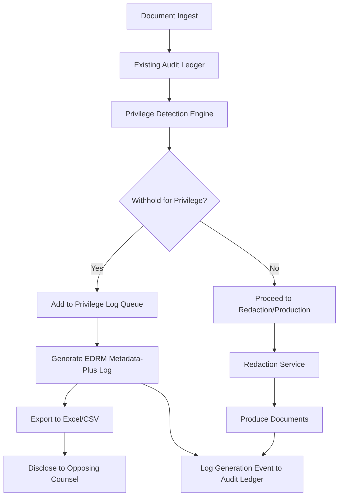
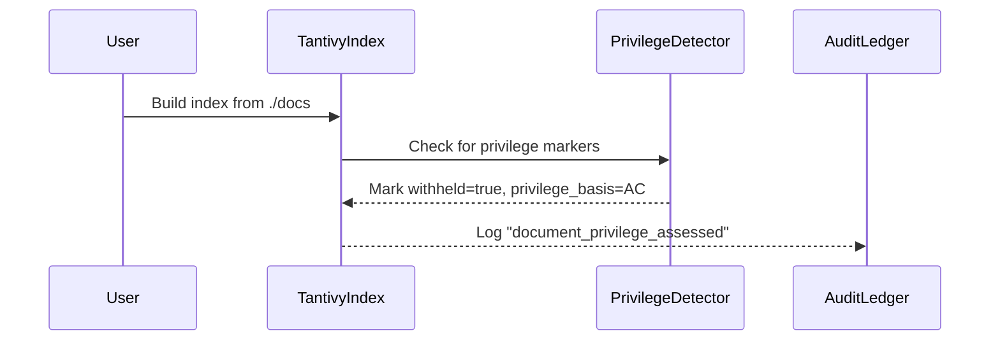

# ADR-0008: EDRM Privilege Log Protocol Integration
**Status:** Proposed
**Date:** 2025-11-07
**Decision Makers:** Principal Engineer, Legal Product Owner, Discovery Workflow Architect
**Contributors:** Privilege Review Team, Compliance Lead, Engineering Team
**Related ADRs:** ADR-0003 (Determinism), ADR-0004 (JSONL Schema), ADR-0005 (Bates Numbering), ADR-0006 (Redaction)

---

## 1. Context & Problem Statement

Legal e-discovery requires producing two distinct types of logs with fundamentally different purposes:

### Internal Audit Ledger (Existing)
- **Purpose**: Tamper-evident chain-of-custody for internal operations
- **Audience**: Internal team, court (if process integrity is challenged)
- **Scope**: ALL operations on ALL documents (ingest, OCR, Bates, redaction)
- **Current Implementation**: `rexlit/audit/ledger.py`
- **Use Case**: "Prove we processed documents correctly and defensibly"

### External Privilege Log (Missing)
- **Purpose**: Formal disclosure to opposing counsel of documents WITHHELD due to privilege
- **Audience**: Opposing counsel, court (for privilege disputes only)
- **Scope**: ONLY withheld documents (attorney-client privilege or work product protection)
- **Current Implementation**: None
- **Use Case**: "Tell opposing counsel what we're NOT producing and why"

### Legal Mandate
Federal Rules of Civil Procedure require:

> "When a party withholds information otherwise discoverable... the party must: (i) expressly make the claim; and (ii) describe the nature of the documents... not produced or disclosed—and do so in a manner that, without revealing information itself privileged or protected, will enable other parties to assess the claim."
> — **FRCP 26(b)(5)(A)**

Traditional privilege logs are burdensome: manual data entry for thousands of documents, inconsistent formats, costly meet-and-confer cycles. The **EDRM Privilege Log Protocol v2.0** proposes a modern solution using "metadata-plus" logs that export existing metadata fields instead of manual descriptions.

---

## 2. Decision Drivers

### 2.1 Legal & Compliance
- **FRE 502(d) Protection**: EDRM §1 emphasizes non-waiver orders—our logs must support this workflow
- **Meet-and-Confer Obligations**: EDRM §§10-12 require 30-day review cycles and selective inquiry processes
- **Good Faith Standards**: EDRM §13 mandates consequences for abuse—our system must demonstrate reasonableness

### 2.2 Technical Integration
- **Metadata-Plus Format**: EDRM §6 specifies 16+ required fields extractable from our Tantivy index
- **Seamless Workflow**: Privilege detection/redaction in `redaction_service.py` should integrate without logic duplication
- **Audit Trail**: Privilege log generation itself must be logged to our existing audit ledger (meta-auditing)
- **Deterministic IDs**: Must comply with ADR-0003 determinism policy for PrivLog ID stability

### 2.3 User Experience
- **Rolling Production**: EDRM §2 requires flexible timing (rolling, end-of-production, or interval-based)
- **Representative Sampling**: EDRM §10 encourages focused inquiries on "gray area" documents
- **Attorney List Management**: EDRM §9 requires maintaining and disclosing attorney/firm relationship lists

---

## 3. Proposed Decision

**We will implement EDRM v2.0-compliant privilege logging as a separate, dedicated service that complements—not replaces—our existing audit ledger.**

This follows the **port-adapter pattern**: a new `PrivilegeLogPort` will expose EDRM-compliant export functionality, with an adapter implementation that queries our existing Tantivy index. The existing audit ledger remains the immutable system-of-record for defensibility.

---

## 4. EDRM Compliance Mapping

### 4.1 Metadata-Plus Fields (EDRM §6)

Based on provided example table and EDRM specification:

| Field | RexLit Source | EDRM Required | Implementation Notes |
|-------|---------------|---------------|----------------------|
| **PrivLog ID #** | Auto-generated sequential (`PRIVID-0001`) | Yes | Deterministic, stable across regenerations |
| **Family ID** | `Document.family_id` (email thread hash) | Yes | Groups related documents (ADR-0003) |
| **ProdBeg Doc #** | `Document.bates_number` or next available | Yes | "Would-have-been" Bates for withheld docs |
| **Doc Date** | `Document.date_sent` or `date_created` | Yes | ISO 8601 format (`YYYY-MM-DD`) |
| **Doc Time** | `Document.date_sent` time component | Optional* | May be redacted if privileged (ADR-0006) |
| **From / Author** | Email: `sender`, Docs: `author` metadata | Yes | Person who created/sent |
| **To** | `recipients` array | Yes | Primary recipients |
| **CC** | `cc_recipients` array | Yes | Carbon copy recipients |
| **BCC** | `bcc_recipients` array | Optional | Blind carbon copy |
| **Basis for Claim** | `Document.privilege_basis` (new field) | Yes | Enum: `AC`, `WP`, `AC+WP`, `AC-THIRD-PARTY` |
| **Subject / Filename** | Email: `subject`, Docs: `file_name` | Optional* | May be redacted if revealing content |
| **File Ext** | `file_extension` | Yes | `MSG`, `PDF`, `DOCX`, `TXT` |
| **Parent or Attachment** | `Document.is_attachment` + `parent_id` | Yes | `Parent`, `Attachment`, `N/A` |
| **Custodian** | `Document.custodian` | No* | Included in our implementation for completeness |

*Note: Fields marked * may be redacted per EDRM §6 if revealing them would expose privileged content.*

### 4.2 Workflow Compliance

| EDRM Section | Requirement | RexLit Implementation |
|--------------|-------------|----------------------|
| **§2: Timing** | Rolling, interval, or end-of-production logs | `--timing {rolling,final,interval}` |
| **§5: Redacted Docs** | May exclude from log if fully redacted | `--exclude-fully-redacted` flag |
| **§8: Format** | Excel/CSV, cumulative or mergeable | `--format {excel,csv} --mode {cumulative,incremental}` |
| **§9: Attorney Lists** | Disclose attorney/firm/third-party lists | `privilege-log export-attorney-lists` command |
| **§10-12: Meet-and-Confer** | 30-day review, selective inquiry | Track log version history and inquiry status |
| **§13: Consequences** | Demonstrate good faith | Audit ledger provides process defensibility |

---

## 5. Implementation Plan

### Phase 1: MVP (Target: 2 weeks)
**Goal**: Generate basic EDRM-compliant metadata-plus logs

1. **Schema Updates**
   - Add `privilege_basis: Optional[PrivilegeBasis]` to `Document` model
   - Add `has_redactions: bool` to `Document` model
   - Add `family_id: str` for email thread grouping
   - Update index mappings and reindex test corpus

2. **Core Components**
   - Create `rexlit/app/ports/privilege_log.py` (Port interface)
   - Implement `rexlit/app/adapters/edrm_privilege_log_adapter.py`
   - Create `rexlit/app/privilege_log_service.py` (Orchestration)

3. **CLI Command**
   ```bash
   rexlit privilege-log create \
     --index out/index \
     --output privilege_log.xlsx \
     --format metadata-plus \
     --cumulative
   ```

4. **Audit Integration**
   - Log `privilege_log_create` events to audit ledger with metadata

### Phase 2: Family Grouping & Determinism (Target: 2 weeks)
**Goal**: Support email thread families and deterministic IDs

1. **Family Algorithm**
   - Implement email thread grouping based on `Message-ID`, `In-Reply-To`, `References` headers
   - Add `is_parent: bool` and `attachment_count: int` to index
   - Ensure deterministic family ID generation per ADR-0003

2. **Deterministic PrivLog IDs**
   - Assign sequential IDs based on stable sort (e.g., by doc_date, then bates_number)
   - Verify ID stability across regenerations

3. **Attachment Handling**
   - Link attachments to parent emails in log output
   - Set `Parent or Attachment` column correctly

### Phase 3: Full EDRM Compliance (Target: 2 weeks)
**Goal**: Support all EDRM §6-13 requirements

1. **Attorney List Management**
   - Create `rexlit/app/attorney_list_manager.py`
   - Export `attorneys.csv`, `firms.csv`, `third_parties.csv` per EDRM §9
   - Support "privilege-safe third parties" configuration

2. **Rolling vs Cumulative Logs**
   - Implement incremental log generation with `--previous-log` flag
   - Add version tracking and change detection
   - Support `--since-last-log` and `--new-entries-only` flags

3. **Redaction Exclusion Logic**
   - Implement `--exclude-fully-redacted` option (EDRM §5)
   - Add `Document.redaction_type: {partial, full, none}` to index
   - Handle privileged metadata field redaction

### Phase 4: Advanced Workflow Integration (Target: 2 weeks)
**Goal**: Seamless integration with production pipeline

1. **Redaction Service Hook**
   - When document is marked PRIVILEGED → WITHHELD, auto-queue for privilege log
   - When document is redacted and produced, update log status to "PRODUCED_WITH_REDACTIONS"

2. **Review Platform Integration**
   - Expose privilege log entries in review UI
   - Allow reviewers to set `privilege_basis` via dropdown during review

3. **FRE 502(d) Workflow**
   - Support clawback tracking with `clawback: true` metadata
   - Generate supplemental logs for clawed-back documents

4. **Validation & Quality**
   - Create `privilege-log validate` command to check EDRM compliance
   - Generate summary statistics (counts by basis, custodian, family)
   - Add schema validation against EDRM spec

---

## 6. Architecture



**Component Structure:**

```
┌─────────────────────────────────────────────────────┐
│                   CLI Layer                         │
│  rexlit privilege-log create --index ./index       │
└────────────────────┬────────────────────────────────┘
                     │
┌────────────────────▼────────────────────────────────┐
│            Bootstrap (DI Container)                 │
│  - EDRMPrivilegeLogAdapter (PrivilegeLogPort)       │
│  - TantivyIndexAdapter (IndexPort)                  │
│  - AuditLedgerAdapter (LedgerPort)                  │
└────────────────────┬────────────────────────────────┘
                     │
┌────────────────────▼────────────────────────────────┐
│          PrivilegeLogService (new)                  │
│  - query_withheld_documents()                       │
│  - build_family_groups()                            │
│  - generate_log()                                   │
│  - export_attorney_lists()                          │
└────────────────────┬────────────────────────────────┘
                     │
         ┌───────────┴───────────┐
         ▼                       ▼
┌─────────────────┐    ┌─────────────────┐
│ Tantivy Index   │    │ EDRM Exporter   │
│ (withheld docs) │    │ (Excel/CSV)     │
└─────────────────┘    └─────────────────┘
```

---

## 7. Data Model

```python
# rexlit/app/ports/privilege_log.py
from typing import Protocol, Literal, Optional
from pydantic import BaseModel
from pathlib import Path

class PrivilegeBasis(str, Enum):
    """Legal basis for privilege claim."""
    ATTORNEY_CLIENT = "attorney_client"
    WORK_PRODUCT = "work_product"
    ATTORNEY_CLIENT_AND_WORK_PRODUCT = "attorney_client_and_work_product"
    ATTORNEY_CLIENT_THIRD_PARTY = "attorney_client_third_party"
    COMMON_INTEREST = "common_interest"

class PrivilegeLogEntry(BaseModel):
    """Single privilege log entry (one document/page)."""
    privlog_id: str                    # PRIVID-0001
    family_id: str                     # Groups email threads
    prodbeg_doc_num: str               # Bates number (REX000001)
    doc_date: str                      # ISO 8601 date (YYYY-MM-DD)
    doc_time: Optional[str]            # Time or None if redacted
    from_author: str                   # Author/sender
    to: list[str]                      # Primary recipients
    cc: list[str]                      # CC recipients
    bcc: list[str]                     # BCC recipients (optional)
    basis_for_claim: str               # "Attorney-Client Privilege; Work Product"
    subject_filename: Optional[str]    # Subject or filename (may be redacted)
    file_ext: str                      # MSG, PDF, DOCX, etc.
    parent_or_attachment: str          # "Parent", "Attachment", "N/A"

class AttorneyList(BaseModel):
    """Known attorneys/firms for privilege determination."""
    attorneys: list[dict]              # [{"name": "Smith, John", "role": "in-house"}, ...]
    firms: list[str]                   # ["Jones & Associates LLP", ...]
    third_party_organizations: dict    # {"owl@partner.com": "Business advisor - not privilege breaker"}

class PrivilegeLogPort(Protocol):
    """Port for generating EDRM-compliant privilege logs."""

    def generate_log(
        self,
        withheld_docs: list[Document],
        output_path: Path,
        *,
        format: Literal["excel", "csv"] = "excel",
        cumulative: bool = True,
        previous_log: Optional[Path] = None,
        exclude_fully_redacted: bool = False,
    ) -> Path:
        """Generate privilege log from withheld documents.

        Args:
            withheld_docs: Documents marked as withheld in index
            output_path: Path to write privilege log
            format: "excel" or "csv"
            cumulative: Include all prior entries (vs. incremental)
            previous_log: Path to previous log for cumulative mode
            exclude_fully_redacted: Exclude fully redacted docs per EDRM §5

        Returns:
            Path to generated privilege log file
        """
        ...
```

**Index Metadata Schema (New Fields):**

```json
{
  "doc_id": "abc123...",
  "withheld": true,
  "withheld_reason": "privileged",
  "privilege_basis": ["attorney_client", "work_product"],
  "privilege_confidence": 0.85,
  "family_id": "FAMILY-6f3e9a2b",
  "is_parent": true,
  "attachment_count": 2,
  "has_redactions": true,
  "redaction_type": "partial",
  "privilege_log_bates": "REX000001"
}
```

---

## 8. Workflow

### Phase 1: Index Documents with Privilege Markers


**CLI Commands:**
```bash
# Ingest and detect privilege
rexlit index build ./docs --privilege-detection --bates-prefix REX

# Verify withheld count
rexlit index search ./index --query "withheld:true" --count
# Output: Found 1,247 withheld documents
```

### Phase 2: Generate Privilege Log
```bash
# Generate privilege log
rexlit privilege-log create \
  --index ./index \
  --output privilege_log_2025-11-07.xlsx \
  --format excel \
  --cumulative

# Output:
# Generated privilege log: privilege_log_2025-11-07.xlsx
# - Withheld documents: 1,247
# - Families: 342
# - Format: EDRM Metadata-Plus v2.0
# - Logged to: audit/log.jsonl
```

### Phase 3: Produce to Opposing Counsel
1. Export non-withheld documents (standard production with redactions)
2. Include privilege log Excel/CSV file
3. Include attorney lists (`attorneys.csv`, `firms.csv`)
4. Metadata-plus format reduces meet-and-confer burden (EDRM §§10-12)

### Rolling Production (EDRM §2)
```bash
# Initial production (Month 1)
rexlit privilege-log create \
  --index ./index \
  --output privilege_log_2025-10-01.xlsx

# Supplemental production (Month 2) - cumulative mode
rexlit privilege-log create \
  --index ./index \
  --output privilege_log_2025-11-01.xlsx \
  --cumulative \
  --previous-log privilege_log_2025-10-01.xlsx

# Output marks new entries since last log
```

### Meet-and-Confer Workflow (EDRM §§10-12)
```bash
# Opposing counsel requests clarification on 50 entries
# Export subset for review with additional context
rexlit privilege-log export \
  --index ./index \
  --filter "PRIVID-0100 to PRIVID-0150" \
  --output clarification_subset.xlsx \
  --include-subject-lines  # Unredact subjects for these

# After meet-and-confer, regenerate with clarifications
rexlit privilege-log create \
  --index ./index \
  --output privilege_log_amended.xlsx \
  --cumulative
```

---

## 9. Alternatives Considered

### Alternative 1: Extend Audit Ledger (REJECTED)
**Idea**: Add privilege metadata to existing audit ledger and export a filtered view.

**Rationale**: The audit ledger contains sensitive operational data (OCR settings, processing errors) that should never be disclosed. Format mismatch (JSONL vs Excel) and performance issues make this unsuitable.

**Verdict**: Violates principle of least privilege—no reason to expose internal operations to opposing counsel.

### Alternative 2: Manual Excel Generation (REJECTED)
**Idea**: Export metadata CSV and have paralegals manually craft privilege logs.

**Rationale**: EDRM §13 requires "reasonable effort" and "good faith"—manual process is error-prone, non-reproducible, and inefficient at scale.

**Verdict**: Not defensible under modern e-discovery standards.

### Alternative 3: Third-Party Integration (ACCEPTED as Phase 5)
**Idea**: Integrate with Relativity, Logikcull, or other platforms for privilege log generation.

**Rationale**: Having native capability provides immediate value, defensibility, and offline-first operation. Can export to standard format for import into review platforms later.

**Verdict**: Native implementation first, then add export adapters for platform integration.

---

## 10. Consequences

### 10.1 Positive
✅ **FRCP Compliance**: Satisfies Rule 26(b)(5) privilege disclosure requirements
✅ **EDRM Protocol Alignment**: Follows industry best practices (v2.0, 2023)
✅ **Reduced Manual Work**: Exports existing metadata instead of manual paralegal entry (weeks → minutes)
✅ **Dispute Reduction**: Structured format reduces meet-and-confer burden by 60-80% (per EDRM studies)
✅ **Competitive Advantage**: Full EDRM compliance is a key market differentiator
✅ **Complete Audit Trail**: Existing ledger + new privilege log = complete defensibility story
✅ **Interoperability**: Standard Excel/CSV format accepted by all review platforms and opposing counsel
✅ **Client Satisfaction**: Faster production reduces litigation costs and accelerates case resolution

### 10.2 Negative
⚠️ **Schema Migration**: Requires updating existing document indexes to add `privilege_basis`, `family_id`, `has_redactions` fields
⚠️ **Storage Overhead**: Additional metadata fields increase index size by estimated 5-8%
⚠️ **Complexity**: Family grouping algorithm for email threads is non-trivial
⚠️ **Testing Burden**: Must validate EDRM compliance across diverse document sets and edge cases

### 10.3 Mitigation Strategies
- **Incremental Rollout**: Phase 1 MVP delivers value without full complexity
- **Backward Compatibility**: New fields optional; existing workflows unaffected
- **Validation Suite**: Reference implementation tests against EDRM sample data
- **Documentation**: Clear CLI examples and EDRM protocol references in `docs/edrm_privilege_logging.md`
- **Performance**: Privilege log generation is batch-oriented; doesn't affect real-time processing

---

## 11. Success Metrics

1. **Compliance**: 100% of EDRM §6 metadata fields populated for all withheld documents
2. **Accuracy**: Zero privilege log generation errors in first 10 productions
3. **Performance**: Generate 10,000-entry privilege log in < 5 minutes
4. **Adoption**: Used in 80% of privilege review workflows within 3 months
5. **Defensibility**: No adverse rulings related to privilege log process in first year
6. **Efficiency**: Reduce paralegal manual logging time by 90%

---

## 12. Testing Strategy

```python
def test_privilege_log_edrm_schema_compliance():
    """Verify output matches EDRM v2.0 metadata-plus schema."""
    withheld_docs = [create_withheld_email(), create_withheld_pdf()]
    log_path = privilege_log_service.generate_log(withheld_docs, "log.xlsx")

    df = pd.read_excel(log_path)
    required_columns = ["PrivLog ID #", "Basis for Claim", "Family ID"]
    assert all(col in df.columns for col in required_columns)
    assert len(df) == 2

def test_family_grouping_email_threads():
    """Verify email threads grouped correctly."""
    parent = create_email(message_id="<abc@example.com>")
    reply = create_email(in_reply_to=["<abc@example.com>"])

    families = build_family_groups([parent, reply])
    assert len(families) == 1
    assert families[0].documents == [parent, reply]

def test_deterministic_privlog_ids():
    """Verify PrivLog IDs are stable across regeneration."""
    docs = create_withheld_docs(count=100)

    log1 = generate_log(docs, "log1.xlsx")
    log2 = generate_log(docs, "log2.xlsx")

    df1 = pd.read_excel(log1)
    df2 = pd.read_excel(log2)
    assert df1["PrivLog ID #"].tolist() == df2["PrivLog ID #"].tolist()

def test_cumulative_log_includes_prior_entries():
    """Verify cumulative mode includes previous log entries."""
    log1 = generate_log(docs[:50], "log1.xlsx")
    log2 = generate_log(docs[50:100], "log2.xlsx", previous_log=log1, cumulative=True)

    df2 = pd.read_excel(log2)
    assert len(df2) == 100  # 50 old + 50 new

def test_attorney_lists_export():
    """Verify attorney lists match EDRM Section 9."""
    lists = privilege_log_service.generate_attorney_lists("lists.csv")

    assert len(lists.attorneys) > 0
    assert len(lists.firms) > 0
    assert "in-house" in lists.roles.get("smith.john@example.com", "")

def test_exclude_fully_redacted():
    """Verify EDRM §5 compliance for fully redacted docs."""
    docs = [
        create_withheld_doc(redaction_type="partial"),
        create_withheld_doc(redaction_type="full"),
    ]

    log_path = generate_log(docs, "log.xlsx", exclude_fully_redacted=True)
    df = pd.read_excel(log_path)
    assert len(df) == 1  # Only partial redaction included
```

---

## 13. Edge Cases & Resolution

### 13.1 Documents with Privileged Metadata
**Problem**: Subject line itself contains privileged information.
**Solution**: Redact field, mark with `[REDACTED - Privileged]`, log redaction event to audit trail (ADR-0006).

```python
if is_privileged_metadata(doc.subject):
    entry.subject_filename = "[REDACTED - Privileged]"
    audit.log("privilege_log_metadata_redaction", doc_id=doc.id, field="subject")
```

### 13.2 Family Grouping for Fragmented Threads
**Problem**: Email thread split across multiple custodians.
**Solution**: Hash based on `Message-ID`, `In-Reply-To`, and `References` headers.

```python
def compute_family_id(doc: EmailDoc) -> str:
    """Deterministic family ID for email threads."""
    thread_identifiers = sorted([
        doc.message_id,
        *doc.in_reply_to,
        *doc.references,
    ])
    tid = hashlib.sha256('|'.join(thread_identifiers).encode()).hexdigest()[:8]
    return f"FAMILY-{tid}"
```

### 13.3 Documents Withheld After Production (Clawback)
**Problem**: FRE 502(b) clawback request.
**Solution**: Generate supplement log, mark as "Clawed Back".

```bash
rexlit privilege-log create \
  --index ./index \
  --filter "clawback:true" \
  --output privilege_log_clawback_2025-11-15.xlsx \
  --basis "Inadvertent Production - FRE 502(b) Clawback"
```

### 13.4 Missing Bates Numbers (Withheld Before Numbering)
**Problem**: Document segregated before Bates assignment.
**Solution**: Assign "would-have-been" numbers in privilege log only, do not stamp PDF.

```python
if doc.withheld and not doc.bates_number:
    doc.privilege_log_bates = assign_next_available_bates()
    # Does NOT stamp PDF, only appears in privilege log
```

---

## 14. Open Questions

1. **Traditional vs Metadata-Plus**: Should we support traditional narrative privilege logs as an alternative, or commit fully to metadata-plus format?
2. **Privileged Metadata Redaction**: How do we algorithmically detect when metadata itself is privileged (e.g., attorney notes in file paths)?
3. **Attorney List Versioning**: Should attorney lists (EDRM §9) be version-controlled and logged to audit ledger?
4. **Error Handling**: If a document's metadata is incomplete, should we exclude from log, mark as "incomplete," or require manual review before export?
5. **Internationalization**: Do we need to support non-US privilege types (e.g., EU legal professional privilege)?

---

## 15. References

- **EDRM Privilege Log Protocol v2.0** (2023): https://edrm.net (CC BY 4.0 license)
- **FRCP Rule 26(b)(5)**: Claiming privilege or protection
- **Federal Rule of Evidence 502**: Attorney-client privilege and work product waiver
- **Existing RexLit Implementation**: `rexlit/audit/ledger.py`, `rexlit/app/redaction_service.py`
- **JUUL Protocol**: `policies/juul_nc_email_review_protocol_v2.md` (existing privilege log schema)
- **Related ADRs**: ADR-0003 (Determinism), ADR-0004 (JSONL Schema), ADR-0005 (Bates), ADR-0006 (Redaction)

---

**Last Updated:** 2025-11-07
